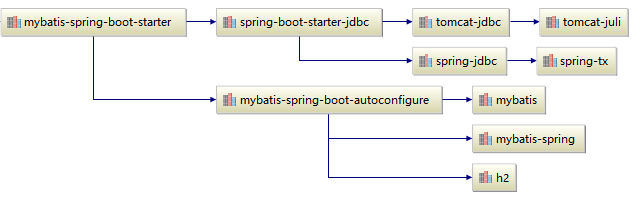

# MyBatis
v3.4.5

## Concept

- xml
- mapper
- sessionFactory
- 动态SQL标签
  - if
  - choose (when, otherwise)
  - trim (where, set)
  - foreach
- 关联查询
  - 一对一 association
  - 一对多 collection
- 缓存
  - 一级缓存
  - 二级缓存

## Spring 集成 MyBatis

mybatis-spring

## MyBatis-Spring-Boot-Starter
v1.3.1

mybaits-spring-boot-starter

## REF

- [mybatis/mybatis-3](https://github.com/mybatis/mybatis-3)
- [blog.mybatis.org](http://blog.mybatis.org)