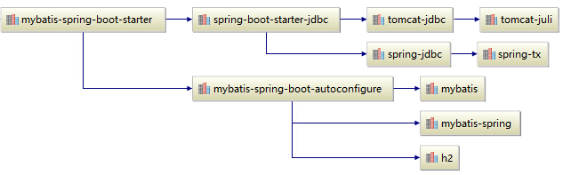

# Spring Boot

## bootstrap

- [start.spring.io](https://start.spring.io)

## 集成Druid

- [druid](../../jdbc/druid/Druid.md)

## 集成Mybatis

## REF

- [spring-boot/reference](https://docs.spring.io/spring-boot/docs/current/reference/html/)

