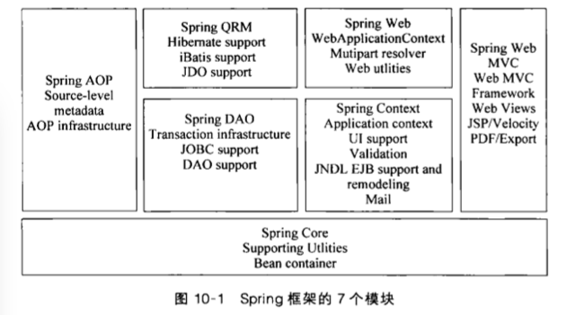

# Spring Framework

## Module

- [Spring Core](#core)
- [Spring AOP](#aop)
- Spring DAO
- Spring ORM
- Spring Content
- Spring Web
- Spring MVC

SpringFramework2.0-module

支持不绑定到特定J2EE服务的可重用业务和数据访问对象。

**约定优于配置原则**

xml配置 => 注解配置 => Java配置

**SpringFramework 四大基本原则**

1. 使用POJO进行轻量级和最小侵入式开发
1. 通过依赖注入和基于接口编程实现松耦合
1. 通过AOP和默认习惯进行声明式编程
1. 使用AOP和模板减少模式化代码

## Core
v4.3.12

自动配置`bean`

## IoC
Inversion of Control, 控制反转

控制权由应用代码转移到了外部容器，控制权的转移就是所谓的反转。

**DI (Dependency Injection), 依赖注入**

组件之间的依赖关系由容器在运行时决定，即由容器动态地将某种依赖关系注入到组件中。

**BeanFactory**

BeanFactory, ApplicationContext

声明Bean的注解：

## AOP

AspectJ切入点(pointcut)语言

@AspectJ切面(aspect)声明类型

- **事务处理**
  - 声明式事务处理
  - 编程式事务处理

### Aspects

基于 AspectJ 的AOP支持

## REF

- [spring](https://spring.io)

## Book

- [spring-in-action-fourth-edition](https://www.manning.com/books/spring-in-action-fourth-edition)
- JavaEE开发的颠覆者 Spring Boot实战 / 汪云飞