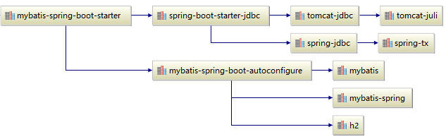

# Spring Boot
v1.5.8

- [SpringBootActuator](SpringBootActuator.md)
- [Druid](../../connectionpool/druid/Druid.md)


## spring-core
v4.3.12

自动配置`bean`

## Command

- run
```bash
mvn spring-boot:run
java -jar target/spring-boot-demo.jar
```


## 集成Mybatis

mybaits-spring-boot-starter


## REF

- [start.spring.io](https://start.spring.io)
- [spring-boot/reference](https://docs.spring.io/spring-boot/docs/current/reference/html/)
- [spring-boot/reference/using-boot-starter](https://docs.spring.io/spring-boot/docs/current/reference/htmlsingle/#using-boot-starter)
- [guides](https://spring.io/guides/gs/spring-boot/)
- [Common application properties](https://docs.spring.io/spring-boot/docs/1.5.8.RELEASE/reference/htmlsingle/#common-application-properties)
