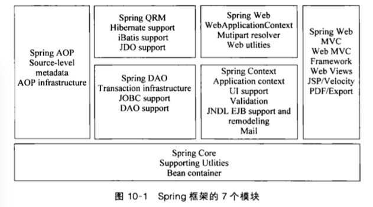

# Spring Framework

## Module

- Spring Core
- Spring AOP
- Spring DAO
- Spring ORM
- Spring Content
- Spring Web
- Spring MVC

SpringFramework2.0-module

支持不绑定到特定J2EE服务的可重用业务和数据访问对象。

## IoC
Inversion of Control, 控制反转

控制权由应用代码转移到了外部容器，控制权的转移就是所谓的反转。

**DI (Dependency Injection), 依赖注入**

组件之间的依赖关系由容器在运行时决定，即由容器动态地将某种依赖关系注入到组件中。

**BeanFactory**

BeanFactory, ApplicationContext

## AOP

AspectJ切入点(pointcut)语言

@AspectJ切面(aspect)声明类型

- **事务处理**
  - 声明式事务处理
  - 编程式事务处理

## REF

- [spring](https://spring.io)
