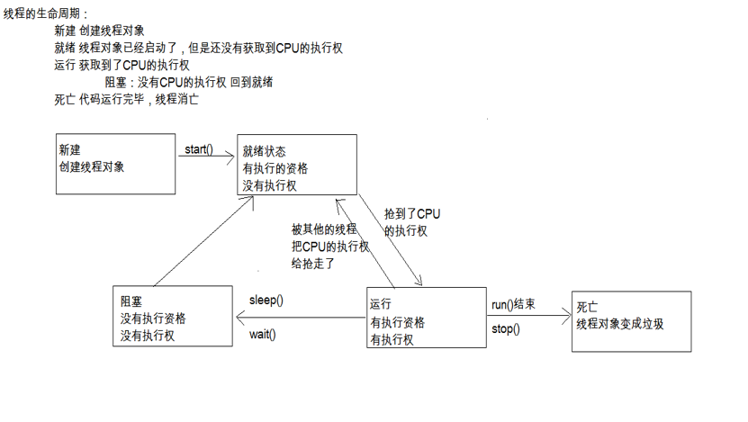
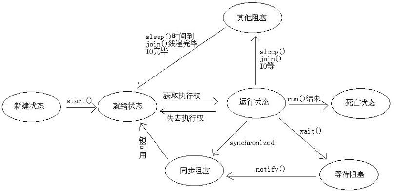
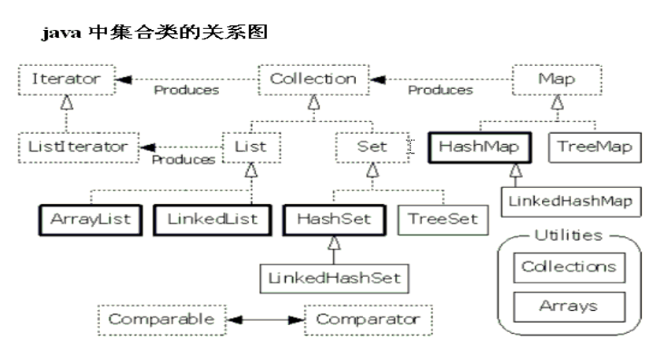

# J2SE (Java 2 Platform Standard Edition)


Content
---

**Base Features**

- [OOP](#oop)
- [Exception](#exception)
- [Multi-Threaded](#multi-threaded)
- [Collection](#collection)
- [IOStream](#idstream)
- [API](#api)
- [AWT](#awt)
- [Socket](#socket)

**Advanced Features**

- Annotation
- [ClassLoader](#classloader)
- [Reflect](#reflect)
- Proxy

**New Features**

- [JDK5 New Features](#jdk5newfeatures)
  - [自动装箱和拆箱](#自动装箱和拆箱)
  - [泛型](#泛型)
  - [增强for循环](#增强for循环)
  - 静态导入
  - [可变参数](#可变参数)
  - [Enum](#enum)
  - [Annotation](#annotation)
- [JDK7 New Features](#jdk7newfeatures)
  - 二进制字面量
  - 数字字面量可以出现下划线
  - switch 语句可以用字符串
  - 泛型简化
  - 异常的多个catch合并
  - try-with-resources 语句


## OOP
Object Oriented Programming

### 编程思想

面向对象，面向过程

### 特性

- **封装 encapsulation**

`private`

- **继承 inheritance**

```
extends
super/this
overload/override
final
```


- **多态 polymorphism**

前提和体现：
1. 有继承关系	
1. 有方法重写	
1. 有父类引用指向子类对象

对象在不同时刻表现出来的不同状态。

举例：
	猫(猫,动物)
	水(液态,固态,气态)

前提：
	A:要有类的继承或者接口的实现
	B:要有方法的重写
	C:父类(接口)引用指向子类对象

```
class Fu
{
	int num = 10;
	public void show()
	{
		sop("fu");
	}
}

class Zi extends Fu
{
	int num = 20;
	public void show()
	{
		sop("zi");
	}

	public void paly()
	{
		sop("魔兽世界");
	}
}

class Zi2 extends Fu
{
	public void show()
	{
		sop("zi2");
	}
}

class Test
{
	public static void main(String[] args)
	{
		//Fu f = new Fu();
		//Zi z = new Zi();
		
		//多态
	
		Fu f = new Zi();
		f.show(); //zi
		sop(f.num);//10

		f = new Zi2();
		f.show();

		//f.play();
		

		/*
		Zi z = new Zi();
		z.show();

		Zi2 z2 = new Zi2();
		z2.show();
		*/
	}
}
```


### 类之间的关系

- 依赖use-a
- 聚合has-a
- 继承is-a


### 特殊类

抽象类 abstract

接口 interface

类与类，类与接口，接口与接口

抽象类与接口的关系：
1. 抽象类 is-a
1. 接口 like-a

内部类
1. 成员内部类
1. 局部内部类
1. 匿名内部类

## Exception

异常类层次结构：

- Object
  - Throwable
    + Exception
      - ClassNotFoundException
      - IOException
      - AWTException
      + **RuntimeException**
        - ArithmeticException
        - NullPointerException
        - IndexOutOfBoundsException
          - ArrayIndexOutOfBoundsException
        - IllegalArgumentException
        - Several more classes
      - Several more classes
    + Error
      - LinkageError
      - VirtualMachineError
      - AWTError
      - Several more classes


异常抛出 throw/throws 与捕获 try/catch/finally

断言 assert

> throw 和 throws 的区别

- throws

用在方法声明后面，跟的是异常类名
可以跟多个异常类名，用逗号隔开
表示抛出异常，由该方法的调用者来处理
throws表示出现异常的一种可能性，并不一定会发生这些异常

- throw

用在方法体内，跟的是异常对象名
只能抛出一个异常对象名
表示抛出异常，由方法体内的语句处理
throw则是抛出了异常，执行throw则一定抛出了某种异常  



## Multi-threaded
多线程

多线程实现方案：
- **继承Thread类**
- **实现Runnable接口**
- 实现Callable，需和**线程池**结合

解决线程安全，关键在于**锁**对象，同步方式：
- 同步代码块 `synchronized(对象){需要同步的代码;}`
- 同步方法

启动一个线程是run()还是start()的区别：
- run():封装了被线程执行的代码，直接调用仅仅是普通方法的调用
- start():启用线程，并由jvm自动调用run()方法

sleep()和wait()方法的区别：
- sleep():必须指定时间；不释放锁
- wait():可以不指定时间，也可以指定时间；释放锁

为什么wait(),notify(),notifyAll()等方法都定义在Object类中
- 因为这些方法的调用是依赖于锁对象的，而同步代码块的锁对象是任意锁。
- 而Object代码任意的对象，所以，定义在Object类中

线程的生命周期图：
- 新建 -- 就绪 -- 运行 -- 死亡
- 新建 -- 就绪 -- 运行 -- **阻塞** -- 就绪 -- 运行 -- 死亡




线程的被阻塞状态：
- 线程中调用了sleep()方法
- 线程调用了一个在I/O上被阻塞的操作
- 线程试图获得某个对象的锁，但该锁正在被其它线程占用

线程控制：
- 线程休眠
`public static void sleep(long millis)`
- 线程加入
`public final void join()`
- 线程礼让
`public static void yield()`
- 后台线程
`public final void setDaemon(boolean on)`
- 中断线程
```
public final void stop()
public void interrupt()
```

死锁问题(Dead Lock):


## Collection
集合

- Collection
  + List
    - ArraryList
    - Vector
    - LinkedList
  + Set
    - HashSet
    - TreeSet
- Map




### 可变参数

Arrays工具类中的一个方法

`public static <T> List<T> asList(T... a)`


### 泛型
JDK5新特性

类型转换安全

泛型类、泛型方法、泛型接口


### Q&A

HashMap 和 HashTable 的区别

Collection 和 Collections 的区别

List, Set, Map 是否继承自 Collection 接口

ArrayList， Vector， LinkedList的存储性能和特性

你所知道的**集合类**都有哪些？主要方法？


## IOStream

### 字节流

```
InputStream/OutputStream
FilterInputStream/FilterOutputStream
BufferedInputStream/BufferedOutputStream
DataInputStream/DataOutputStream
ObjectInputStream/ObjectOutputStream  // 序列化流
```


### 字符流

`Reader/Writer`

字符流=字节流+编码表


转换流 `FileReader/FileWriter`


### Q&A

Java中有几种类型的流？JDK为每种类型的流提供了一些抽象类以供继承，请说出他们分别是哪些类？

什么是Java序列化，如何实现Java序列化？


## API
Application Programming Interface, 应用程序变成接口

常用类：
- Object类/Scanner类
- String类/StringBuffer类/StringBuilder类
- 数组高级和Arrays类
- 基本类型**包装类**(Integer,Character)
- 正则表达式(Pattern,Matcher)
- Math类/Random类/System类
- BigInteger类/BigDecimal类
- Date类/DateFormat类/Calendar类


### 自动装箱和拆箱

静态导入

JDK1.5以后，简化了定义方式。
```
Integer x = new Integer(4);可以直接写成
Integer x = 4;//自动装箱。
x  = x + 5;//自动拆箱。通过intValue方法。
```

需要注意：
在使用时，Integer  x = null;上面的代码就会出现NullPointerException。

### BigDecimal

不可变的、任意精度的有符号十进制数。


### 增强for循环

```
for(元素数据类型 变量 : 数组或者Collection集合) {
	使用变量即可，该变量就是元素
    }
```


## AWT
Abstract Window ToolKit

java.awt

### Swing

awt的补充

JFrame

javax.swing


## Socket


网络模型：
- OSI 参考模型
Open System Interconnection 开放系统互连
- TCP/IP 参考模型

Socket机制：
App A <=> Socket <=> Port A <<= IO Stream =>> Port B <=> Socket <=> App B

TCP,UDP:
- TCP: Transmission Control Protocol
- UDP: User Datagram Protocol


## ClassLoader
类加载器

负责将.class文件加载到内在中，并为之生成对应的Class对象。
虽然我们不需要关心类加载机制，但是了解这个机制我们就能更好的理解程序的运行。

类加载器的组成
- Bootstrap ClassLoader 根类加载器
- Extension ClassLoader 扩展类加载器
- Sysetm ClassLoader 系统类加载器


## Reflect
反射

JAVA反射机制是在运行状态中，对于任意一个类，都能够知道这个类的所有属性和方法；对于任意一个对象，都能够调用它的任意一个方法和属性；这种动态获取的信息以及动态调用对象的方法的功能称为java语言的反射机制。


## 动态代理

在Java中java.lang.reflect包下提供了一个Proxy类和一个InvocationHandler接口，通过使用这个类和接口就可以生成动态代理对象。JDK提供的代理只能针对接口做代理。我们有更强大的代理cglib

Proxy类中的方法创建动态代理类对象

`public static Object newProxyInstance(ClassLoader loader,Class<?>[] interfaces,InvocationHandler h)`

最终会调用InvocationHandler的方法

`Object invoke(Object proxy,Method method,Object[] args)`

- JDK动态代理
- cglib动态代理

## JDK5NewFeatures

### Enum
枚举

是指将变量的值一一列出来,变量的值只限于列举出来的值的范围内。

```
public enum 枚举类名 {
			枚举项1，枚举项2，枚举项3…;
}
```

### Annotation
注解


## JDK7NewFeatures

### 二进制字面量

JDK7开始，终于可以用二进制来表示整数（byte,short,int和long）。使用二进制字面量的好处是，可以使代码更容易被理解。语法非常简单，只要在二进制数值前面加 0b或者0B
举例：
int x = ob110110

### 数字字面量可以出现下划线

为了增强对数值的阅读性，如我们经常把数据用逗号分隔一样。JDK7提供了_对数据分隔。
举例：
int x = 100_1000;
注意事项：
不能出现在进制标识和数值之间
不能出现在数值开头和结尾
不能出现在小数点旁边

### switch 语句可以用字符串

### 泛型简化

### 异常的多个catch合并

### try-with-resources 语句

格式：
try(必须是java.lang.AutoCloseable的子类对象){…}
好处：
资源自动释放，不需要close()了
把需要关闭资源的部分都定义在这里就ok了
主要是流体系的对象是这个接口的子类(看JDK7的API)


todo
---


面向切面的变成 AOP

